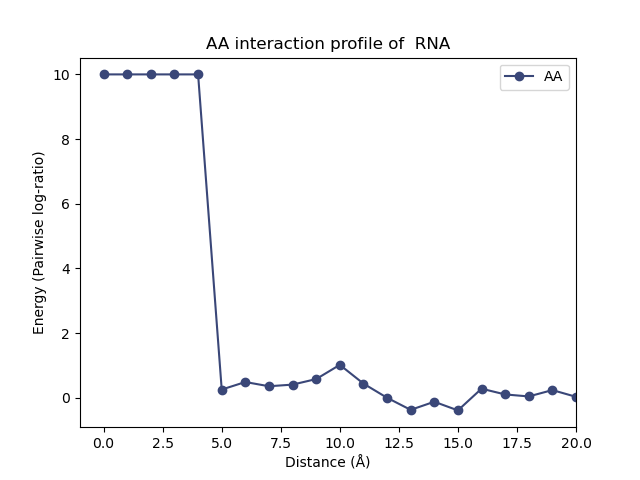

# RNA folding problem
## **This project was created as part of  <span style='background-color:#AA3344'> <b>  Pr. Guillaume Postic</b> </span> 's RNA bioinformatics course.**

### Creation of an objective function for the RNA folding problem
_Finding the native fold for a given ribonucleotide chain among the impossibly large number of possible conformations is the crux of the RNA folding problem. The objective function should be an estimator of this energy because the native fold has the lowest Gibbs free energy of all the folds._


## Installation:


````shell
# 1. Clone
git clone https://github.com/Hanaeelma/TP_RNA_Folding.git
# 2. Change directory
cd RNA_Native_Folding_Project/
# 3. Give running permissions
chmod 777 *
````


### To install the required packages
````shell
pip install -r ./requirements.txt
````

## Run the script
### change <span style='background-color:#AA3344'> 3wdb.pdb </span> to run the same script for other files
````shell
./run_all.py -input PDB -output ScoringValues -savepng True -test 3wdb.pdb
````

## 1<sup>st</sup> script : Train function
### Explanatory notes :
The interatomic distance distribution from a 3D RNA structure dataset of train <span style='background-color:#AA3344'> tp1.py </span> will be used by the RNA folding problems tool to first train the objective function.
The name of the directory containing all of the pdb files necessary for the training is entered as input for this script (for example, "-input PDB").

The name of the directory, whether it already exists or not, in which the scoring value files should be saved will be the second necessary option (for example, "-output ScoringValues").

### This command can be used to run only the train function :
```bash
./TP_part1.py -input PDB -output ScoringValues -details False
```

## 2<sup>nd</sup> script : Plot function

The scoring profile of each pair of residues will be plotted in the second section ('TP part2.py') as a function of the interatomic distance.

The name of the directory in which the script 1 has saved the scoring value files (e.g., "-input ScoringValues") will be the only option that is necessary.

There are two optional choices in the script 2: 
- The first one asks for a boolean input (for example, "-savepng False") and lets you save or not save the plots. defaults to "False." the input folder for saving. 
- The second one accepts a boolean input (for example, "-printpng True") and determines whether to display the plots. defaults to true.

### Run only Plot function :
```bash
./TP_part2.py -input ScoringValues -savepng False -printpng True
```

## 3<sup>rd</sup> script : Test function
Finally, I evaluate the predicted structures from a different 3D RNA structure dataset of test ('TP part3.py') in the third section using the objective function.
The first required option is the name of the directory where the script 1 has saved the scoring values files (for example, "-train ScoringValues").
The name of the pdb file containing the test dataset's 3D structure will be the second necessary option (for example, "-test 3wbd.pdb").

### Run only Test function :
```bash
./TP_part3.py -train ScoringValues -test 3wbd.pdb
```
## Output :
The output figures and files can be found in the ScoringValues folder:

### Example:



